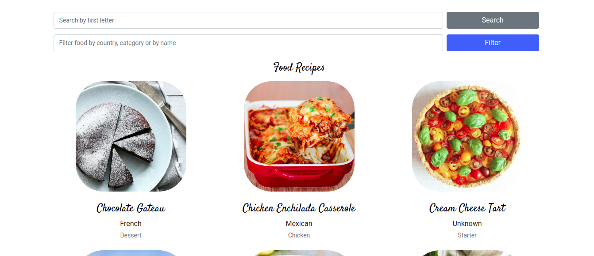

# React-Redux Catalogue Statistics Application
Foodistics is a Catalogue Statistics Application

This projects implements the use of React-redux library to build a Catalogue Statistics application.

1. Foodistics was built entirely using frameworks such as React JS and Redux.
2. ES6 and Modules.
3. Object Oriented Programming Approach.
4. Redux state management

## Built With

- HTML
- Node.js
- React
- React-DOM
- npm
- CSS3
- JavaScript/ES6
- Redux

## Live Demo

[Live Demo Link](https://food-react-redux-api.herokuapp.com/)

## Video Presentation

### Project Description and features

[Link 1](https://www.loom.com/share/abc358ee82694bba9f439f379170d93e)
[Link 2](https://www.loom.com/share/af2ea8fabc7a478d86c2285c326fcd9d)
### Explanation of Technical Concepts

[Link 3](https://www.loom.com/share/fdfbf02d61bd44489fe3a6e2977a6231)

#### What is React?

React is an interactive JavaScript library for building fast and interactive user interfaces.
React gives the ability to build complex UIs from small and isolated pieces of code called components.

When building applications with React, we make use of reusable components. Every React application has at least one root component that contains other components.

So React gives us the possibility to build single components and then put them together to create a more complex UI.

#### What is the Virtual DOM in React?

Virtual DOM is a copy of an actual JavaScript DOM object.
A Virtual DOM is used to compare and update changes between an updated DOM and the Actual DOM.
Whenever a change or the state of a component is changed, React checks the changes that have been made by comparing the Actual DOM and the Virtual DOM. Once this change has been identified, React updates the Actual DOM.

#### Data Flow in Redux

Actions --- Actions are declared (type, data)

Store  <--  Reducers --- appReducer(state, action) - has switch

React

Reducer returns a new state base on the action that was sent.

The store is updated with the new state passed by the reducer

React re-renders the components with the new data.

#### When is Redux Useful?

Redux is useful for SPA because SPAs keep updating the state of various components. Various parts of the application keep changing state.

It is very useful in applications where the state is updated frequently.

### What excite me in React and Redux

[Link 4](https://www.loom.com/share/534e4a3e798f4f16904c4c41cf47a469)
## Getting Started

To get a local copy  and to set it up and running follow these simple example steps.

### Prerequisites

- Browser
- Internet

- Download the code from repository (https://github.com/happiguru/react-redux-api).
- Run `npm install` and `npm start` and then open `http://localhost:3000/` on the browser to view it.

### Testing

- Run `npm test` to test the application.

## Authors

👤 **Stanley Enow Lekunze**

- Github: [@happiguru](https://github.com/happiguru)
- Twitter: [@Lekunze_Nley](https://twitter.com/Lekunze_Nley)
- Linkedin: [lekunze-nley](https://www.linkedin.com/in/lekunze-nley/)

## Show your support

Give a ⭐️ if you like this project!

## Acknowledgments
-This project gave us a better understanding of the visual properties that must be used on a website.

## 📝 License

This project is [MIT](LICENSE) licensed.
